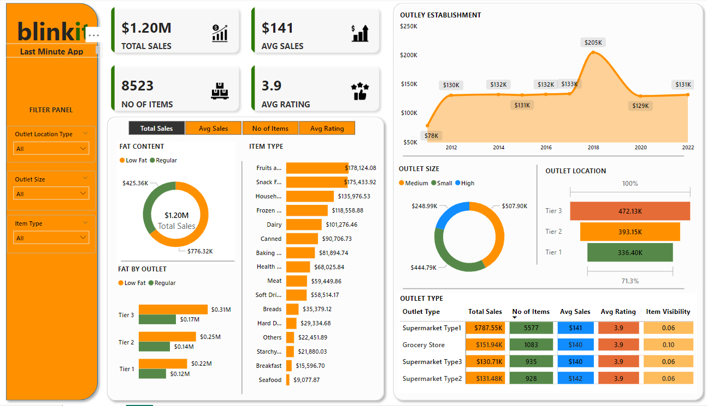

# 🚀 Blinkit App Sales Analysis Dashboard  


## 📊 Project Overview  
Welcome to the **Blinkit App Sales Analysis Dashboard**!  
This project showcases a visually compelling and interactive Power BI dashboard designed to analyze Blinkit's sales data. The goal is to uncover actionable insights, identify trends, and help decision-makers optimize strategies to boost sales and customer satisfaction.

---

## ✨ Key Features  
🔍 **Sales Overview**  
- Provides a snapshot of total sales, revenue, and order volumes.  

📈 **Trend Analysis**  
- Visualizes daily and monthly sales trends to highlight peak and off-peak periods.  

🌍 **Regional Insights**  
- Pinpoints top-performing regions and states to identify geographical sales trends.  

📦 **Product Performance**  
- Tracks the most popular products and categories, giving insights into customer preferences.  

🛒 **Customer Behavior**  
- Analyzes purchase patterns to understand customer buying habits and retention opportunities.  

---

## ⚙️ Tools and Technologies  
- **Power BI**: For dashboard creation and visualization.  
- **Power Query**: Used for cleaning and transforming raw data into a structured format.  
- **Excel/CSV**: Source file format for importing sales data.

---

## 🌟 Insights Uncovered  
- Identified the highest-selling products and categories driving revenue.  
- Highlighted the most profitable regions and their contribution to overall sales.  
- Tracked sales fluctuations over time to align promotional campaigns effectively.  
- Gained a deeper understanding of customer buying trends.

---

## 🚀 How to Use  
1. **Clone this repository** to your local machine:  
   ```bash
   git clone https://github.com/NoData01/blinkit-sales-analysis.git
